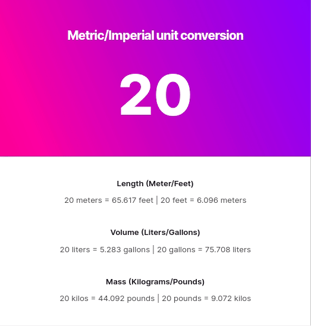

# Unit Converter

A solo project from the [Scrimba Frontend Developer Career Path](https://scrimba.com/learn/frontend)

## Table of contents

- [Overview](#overview)
  - [Requirements](#requirements)
  - [Screenshot](#screenshot)
  - [Links](#links)
- [My process](#my-process)
  - [Built with](#built-with)
  - [Useful resources](#useful-resources)
- [Author](#author)

## Overview

### Requirements

- [x] Save number to a variable in code
- [x] When app loads, do calculations and display the results
- [x] Round numbers to 3 decimal places
- [x] Check out [this CSS gradient generator](https://www.joshwcomeau.com/gradient-generator/)
- [x] Stretch: Add an input for the user to change the number and automatically recalculate the values when it changes

### Screenshot

### Links

- Live Site URL: [https://joshjavier.github.io/unit-converter/](https://joshjavier.github.io/unit-converter/)
- Scrim URL: [https://scrimba.com/scrim/cob8c43af89c8a77efcf42588](https://scrimba.com/scrim/cob8c43af89c8a77efcf42588)

## My process

### Built with

- Semantic HTML5 markup
- CSS Flexbox
- Mobile-first workflow
- Vanilla JS

### Useful resources

- [How to Convert Units of Measurement](https://brownmath.com/bsci/convert.htm) - This helped me grok unit conversions and improve the app architecture to make it "extensible" (adding new conversion factors and units).

- [You probably don't need input type="number"](https://bradfrost.com/blog/post/you-probably-dont-need-input-typenumber/) - Short post on the pitfalls of using number inputs for things that aren't really "numbers" like credit cards and bank account numbers.

- [Everything You Ever Wanted to Know About inputmode](https://css-tricks.com/everything-you-ever-wanted-to-know-about-inputmode/) - This is where I discovered the existence of `inputmode="decimal"` which solved the issue where the number keypad on iOS when using `pattern="[0-9]*"` doesn't have a decimal button.

## Author

- Website (under construction)
- GitHub - [@joshjavier](https://github.com/joshjavier)
- Twitter - [@joshjavierr](https://twitter.com/joshjavierr)
- LinkedIn - [@joshjavier](https://www.linkedin.com/in/joshjavier/)

